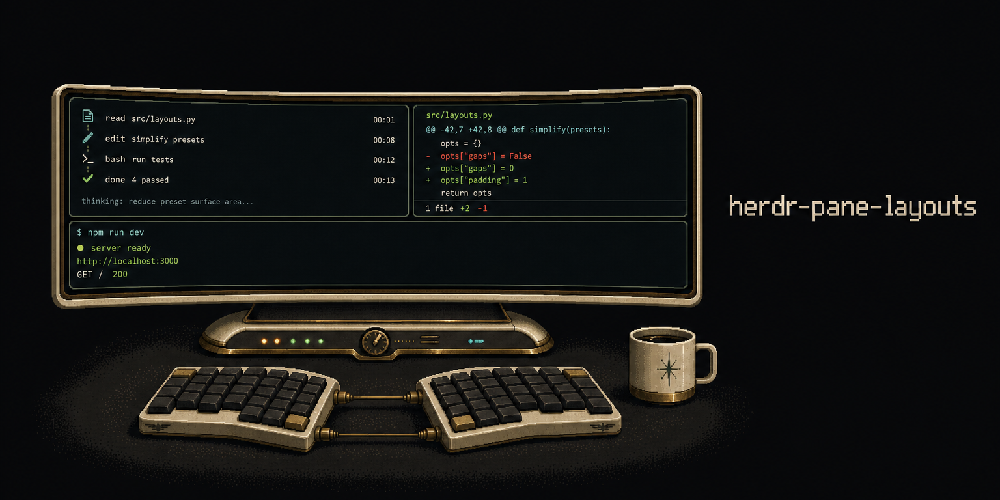

<p align="center">
  
</p>

<h1 align="center">herdr-pane-layouts</h1>

<p align="center"><strong>Seamless tmux-style pane resizing and layouts for Herdr.</strong></p>

## Actions

| Action | Behavior |
|---|---|
| `layouts.equalize` | Equal-width vertical columns |
| `layouts.cycle` | Cycle even vertical, even horizontal, main-left, main-top, and tiled |
| `layouts.resize-left` | Resize left by 2% |
| `layouts.resize-down` | Resize down by 2% |
| `layouts.resize-up` | Resize up by 2% |
| `layouts.resize-right` | Resize right by 2% |

Manual layout changes preserve running processes and scrollback. `equalize` and `cycle` temporarily move panes through a staging tab; if reshaping fails, recovery returns them to the original tab when possible. Zoomed tabs must be unzoomed first.

## Install

Local checkout:

```sh
herdr plugin link ~/projects/my-repos/herdr-pane-layouts
herdr server reload-config
```

GitHub:

```sh
herdr plugin install iurysza/herdr-pane-layouts --yes
```

## Example keybindings

```toml
[[keys.command]]
key = "ctrl+backslash"
type = "plugin_action"
command = "layouts.equalize"
description = "equalize panes as vertical columns"

[[keys.command]]
key = "prefix+space"
type = "plugin_action"
command = "layouts.cycle"
description = "cycle pane layouts"

[[keys.command]]
key = "ctrl+alt+h"
type = "plugin_action"
command = "layouts.resize-left"
description = "resize pane left"
```

## Test

```sh
python3 -m unittest discover -s test -v
python3 -m py_compile src/*.py
```

## Requirements

- Herdr 0.7.0+
- Python 3.10+
- macOS or Linux
